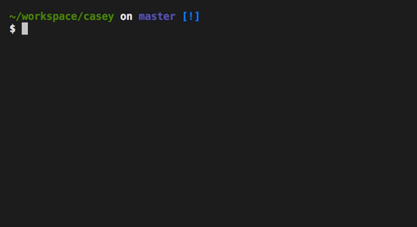

# `casey`

> A simple command line tool to uppercase and lowercase strings.

This `README.md` is written as a tutorial. If you're just interested in using this package, you'll find the usage information first. In the second part I'll explain how this package was created. This should be helpful, if you want to create a similar package or if you want to contribute to this package.

## Usage

To use this program make sure you have [Rust installed with `rustup`](https://www.rust-lang.org) (and you'll also need [Git](https://git-scm.com/)). This program uses stable Rust. Run the following steps to download the source code, compile it and run the program:

```bash
$ git clone git@github.com:donaldpipowitch/casey.git
$ cd casey
$ cargo run
```

You can than start to type any string. This string will be camel cased immediately in the following line and lower cased in the line after that. Note that this program currently doesn't handle multilines, umlauts or other special characters or resizing the screen.

Here is an example of what you would see:



## Contribute

In this section I want to talk about how this program was created, so you are able to create similar projets, fork this project or contribute back to it. I'm happy if you can point out any spelling mistakes as I'm not a native english speaker. In general you're allowed to contribute features back to this project (e.g. like adding multiline support), but keep in mind that I'll only accepts pull requests if this _"Contribute"_ section is kept in sync with the changes. I hope you'll enjoy the read 👋

Before we start one word of warning. I found some parts of this code to be quite "flaky". Take [this commit](https://github.com/donaldpipowitch/casey/commit/6df76a451275e1834b280c22702d420164cd738e) as an example. I'd expect that the deleted line behaves like the two new lines - and on Windows they actually did. But not on my Mac. (Funningly enough I tested the original lines again 18 days later and now they work on my Mac. 🤔) There are probably a lot more edge cases like that one, so take everything with a grain of salt.

To start make sure to have the same prequisites as mentioned in the _"Usage"_ section, namigly have [Rust installed with `rustup`](https://www.rust-lang.org).

I started the project by creating an empty directory and adding some basic files to it for my initial setup.

The [`.gitignore`](.gitignore) is the same we get by running `$ cargo init` (see [here](https://git-scm.com/docs/gitignore), if you want to know more about `.gitignore` files):

```
/target
**/*.rs.bk
```

The [`Cargo.toml`](.Cargo.toml) is _nearly_ the same we get by running `$ cargo init` (see [here](https://doc.rust-lang.org/cargo/reference/manifest.html), if you want to know more about `Cargo.toml` files). I just added [`termion`](https://gitlab.redox-os.org/redox-os/termion) which is our only dependency. `termion` is needed to create a REPL-like application. As mentioned in the _"Usage"_ section we want to _immediately_ show some transformed output of the user input. `termion` will cover the needs for this like clearing lines or moving the cursor in the terminal. [Because of a bug](https://gitlab.redox-os.org/redox-os/termion/issues/140) I actually specified to use the Git source of this crate. (Thank you @JoshMcguigan for the bug fix!):

```
[package]
name = "casey"
version = "0.1.0"
authors = ["Donald Pipowitch <pipo@senaeh.de>"]

[dependencies]
termion = {git = "https://github.com/redox-os/termion"}
```

The whole application was created in the `src/main.rs` file. First we'll import a couple of modules which we need for handling the terminal. Most of them should be quite self-explanatory. If you don't know them - no worry. You'll see how they are used in a bit.

```rust
extern crate termion;

use std::io::{stdin, stdout, Write};
use termion::{clear,
              color,
              cursor::{DetectCursorPos, Goto},
              event::Key,
              input::TermRead,
              raw::{IntoRawMode, RawTerminal},
              terminal_size};
```

Before we move on I'll give you an overview about the logic that we will implement. Let us recap our requirements:
- The user should be able to type something to the terminal.
- We'll immediately uppercase and lowercase the input and show the result _below_ the input of the user.
- Because we ignore line breaks for now, this will give us a total of three lines which we'll show: the input, the uppercased value and the lowercased value.
- And to make everything a little bit more interesting:
  - There will be an empty state which tells the user to start typing.
  - You can remove a character by pressing delete and you can use the left and right arrows for navigation.
  - By pressing Enter we'll "save" the current value and start typing on a completely new line or exit if the value is empty.
  - You can exit via Ctrl+C.

To achieve that we'll use a "state-render-pattern" which says: We have some state which can change based on some events and every time the state changes, we'll render our application. You might already be familiar with something like that from frontend development where this pattern (in different flavors) is currently quite popular.

So we need some state which will be a struct and we need some render function and both of them are glued together in our `main` function. So the high level overview would be:

```rust
struct State {
    // contains all the data we need for rendering the application
}

fn render(state: &State) { // not the real signature! it's simplified here
    // the render function renders our application based on the given state
}

fn main() {
    // create initial state
    // react on events to change state
    // call render and pass the state
}
```

Let's begin with the state. I just copy and paste the relevant code here where its fields are explained in the comments:

```rust
#[derive(Debug)]
struct State {
    // contains the typed input of the user
    value: String,
    // tracks the cursor position (so the user can navigate with the
    // left and right arrow keys within the input)
    cursor_pos: usize,
    // helps to keep track of the line where the user currently types
    // this is partially needed by the render function as well
    start_row: usize,
}

impl State {
    fn new() -> State {
        State {
            value: String::new(),
            cursor_pos: 0,
            start_row: 0,
        }
    }
}
```

The one thing to note should the `start_row` field. This one is purely needed for the rendering function as it sometimes need to know where the current input happens, so other lines can be cleared and we can jump back to this line. That's why the `render` function currently needs a mutable reference of the state - as you'll see in a minute. I'd consider this as a technical debt, but it is okay for now. A good refactoring action would be to split our current `State` into an `ApplicationState` which is needed for the application logic and as read-only data for the `render` function and into a `RenderState` which only the `render` function really needs to know about.

Let's have a look at the `render` function. This one is actually the most complex part, because rendering to the terminal can be quite tricky and buggy. I couldn't find a nice API for all my use cases. One example: To clear a line you don't call a `clear_line` function and pass the index of the line to the function, but you have to place the cursor on the line you want to clear, than clear the current line and after that restore the cursor to its previous position - and this all happens by _writing_ to the terminal. _Ouch!_ If you know a nicer API, please make a pull request. The basic logic of the render function looks like this:
- clear all lines to get a solid base (the user input, the uppercased output and the lowercased output - if the last two aren't yet available, it's not a problem, because we would just clear an empty line)
- write the new lines based on the (changed) state
- restore cursor position 💁‍
- flush everything to the terminal (the _actual_ rendering in the terminal happens here)

Besides the state we need to pass a `RawTerminal` to the `render` function. This is basically our canvas which will be written by the `render`. We literaly do this with the `write!` macro.

```rust
fn render<W: Write>(stdout: &mut RawTerminal<W>, state: &mut State) {
    // clear rows to have a solid base
    // this basically "writes" clear::CurrentLine beginning
    // at the start_row and the next two rows
    for i in 0..3 {
        write!(
            stdout,
            "{}{}",
            Goto(1, state.start_row as u16 + i as u16),
            clear::CurrentLine
        ).unwrap();
    }

    // get the formatted output and write it to the terminal
    // if the formatted output contains multiple lines, it will
    // render every line separately (to avoid some render bugs)
    let formatted = format_value(&state);
    for (i, line) in formatted.lines().enumerate() {
        // if we don't have enough space, because we're at the end
        // of the terminal screen we need to create a new line
        // and adjust the start_row
        let (_total_cols, total_rows) = terminal_size().unwrap();
        if state.start_row + i > total_rows as usize {
            write!(stdout, "\n").unwrap();
            state.start_row -= 1;
        }
        write!(
            stdout,
            "{}{}",
            Goto(1, state.start_row as u16 + i as u16),
            line
        ).unwrap();
    }

    // update cursor
    write!(
        stdout,
        "{}",
        Goto(state.cursor_pos as u16 + 1, state.start_row as u16)
    ).unwrap();

    stdout.flush().unwrap();
}
```

One thing I want to highlight again: This all seems to be quite flaky currently. As far as I know it should be fine to write a string to `stdout` which contains multiple new lines, but it doesn't work correctly for me on the machines where I tested my app. Sometimes a line was missing or wasn't cleared or the cursor position got messed upt. To get rid of all bugs, I actually needed to write every line separately.

As you can see the `render` function calls a function I haven't previously talked about: `format_value`. It was previously part of the `render` function, but I extracted it out. One could argue that this would be the _real_ rendering function. It takes the _immutable_ state as its input and returns the string which should be rendered as the output. It doesn't know about the terminal and could generate a website in the same way for example. This function shows either an empty state or the state with the uppercased and lowercased output. Nicely formatted with some slight coloring.

```rust
fn format_value(state: &State) -> String {
    if state.value.is_empty() {
        format!(
            "{grey}Start typing...{reset}",
            grey = color::Fg(color::LightBlack),
            reset = color::Fg(color::Reset)
        )
    } else {
        format!(
            "{value}\n{grey}{uppercase}\n{lowercase}{reset}",
            value = state.value,
            grey = color::Fg(color::LightBlack),
            uppercase = state.value.to_uppercase(),
            lowercase = state.value.to_lowercase(),
            reset = color::Fg(color::Reset),
        )
    }
}
```

Having everything in place we can start initializing our state, handling "events" to update the state and call `render` on every state change. We do all of this in the `main` function.

First we'll initialize our empty state. For that we'll need our `start_row`, which is basically the current line of the cursor. To get the `start_row` we create an instance of a raw terminal which we just call `stdout`. This is the one we'll pass to `render` as well. Having `stdout` and our initial `state` we can call `render` for the first time to print our empty state screen which should be _"Start typing..."_ in grey letters.

```rust
fn main() {
    let mut stdout = stdout().into_raw_mode().unwrap();
    let (_col, start_row) = stdout.cursor_pos().unwrap();
    let mut state = State::new();
    state.start_row = start_row as usize;
    render(&mut stdout, &mut state);

    // ...handle key presses here
}
```

Now we'll react to "events". The only events we care about are key presses. To get "notified" about them we'll need a [handle of `stdin`](https://doc.rust-lang.org/std/io/fn.stdin.html), so we can iterate over key presses and than `match` on them to handle them in different ways. We are basically stuck in this iteration forever. So the first thing we'll do is adding an exit functionality whenever the user presses `Ctrl+C` (by using the `break` keyword) and just ignore everything else for now. We'll also call `render` at the end. While we don't update the state currently we'll need it in a minute, because all other key presses will modify our state in some way and we want to reflect this change in our GUI.

```rust
fn main() {
    // the empty state screen...

    let stdin = stdin();
    for key in stdin.keys() {
        match key.unwrap() {
            Key::Ctrl('c') => {
                if !state.value.is_empty() {
                    // jump to lower cased line, before exiting in an non-empty state
                    // so no line gets cropped
                    write!(stdout, "{}", Goto(1, state.start_row as u16 + 2)).unwrap();
                }
                break;
            }
            // ...handle other keys here soon
            _ => {}
        }
        render(&mut stdout, &mut state);
    }
}
```

Let's add the most complex key press handler in the next step. Everything else should be easier after that one. The key press handler I'm talking about is handling pressing the `Enter` key. Because this one will add a new line (which is expressed as `\n`), we'll actually handle a new line and not the `Enter` key directly. This handler will cover two different cases. Given we are still (or _again_ as you'll see soon) in the empty state we'll exit our application by using `break` again. Given we're in a non-empty state (e.g. _the user has typed something before_) we want to "keep" our current state by resetting the state and setting a new `start_row`, so our old state gets pushed upwards. We do that by jumping to the last line and adding a new line. Note that there are now two more cases we need to handle: are we at the end of the screen or not? That will influence the concrete new value of `start_row`, because we can't set the `start_row` to a non-visibile line when we are at the end of the screen. We can check, if we are at the end of the screen by calling `terminal_size()`.

I hope this all makes sense and the following code helps to understand these cases better.

```rust
            Key::Ctrl('c') => {
                // ...
            }
            Key::Char('\n') => {
                if state.value.is_empty() {
                    break;
                } else {
                    write!(stdout, "{}\n", Goto(1, state.start_row as u16 + 2)).unwrap();

                    state.value = String::new();
                    state.cursor_pos = 0;
                    let (_total_cols, total_rows) = terminal_size().unwrap();
                    let end_of_screen = state.start_row as u16 + 2 == total_rows;
                    if end_of_screen {
                        state.start_row += 2;
                    } else {
                        state.start_row += 3;
                    }
                }
            }
            // ...handle other keys here soon
            _ => {}
```

Awesome! One last step and our application is complete. We need _four_ more key press handlers which are more simpler.
- When we press any character key we'll insert this char into our current value at our current index (= the cursor position) and we'll move the cursor one character to the right.
- When we press the left arrow we'll move the cursor one character to the left (if possible).
- When we press the right arrow we'll move the cursor one character to the right (if possible).
- When we press backspace we'll remove one character in our current value at our current index and we'll move the cursor one character to the left.

```rust
            Key::Ctrl('c') => {
                // ...
            }
            Key::Char('\n') => {
                // ...
            }
                        Key::Char(key) => {
                state.value.insert(state.cursor_pos, key);
                state.cursor_pos += 1;
            }
            Key::Backspace => {
                if !state.value.is_empty() && state.cursor_pos != 0 {
                    state.value.remove(state.cursor_pos - 1);
                    state.cursor_pos -= 1;
                }
            }
            Key::Left => {
                if state.cursor_pos > 0 {
                    state.cursor_pos -= 1;
                }
            }
            Key::Right => {
                if state.cursor_pos < state.value.len() - 1 {
                    state.cursor_pos += 1;
                }
            }
            _ => {}
```

Great. You can now run `$ cargo run` and should have a working application 😍

---

Thanks for reading so far. I'd be happy to get feedback about this _"Tutorial as a `README.md`"_ format. It is an experiment to teach coding. I'd also be happy if you can point out any spelling mistakes ❤️
